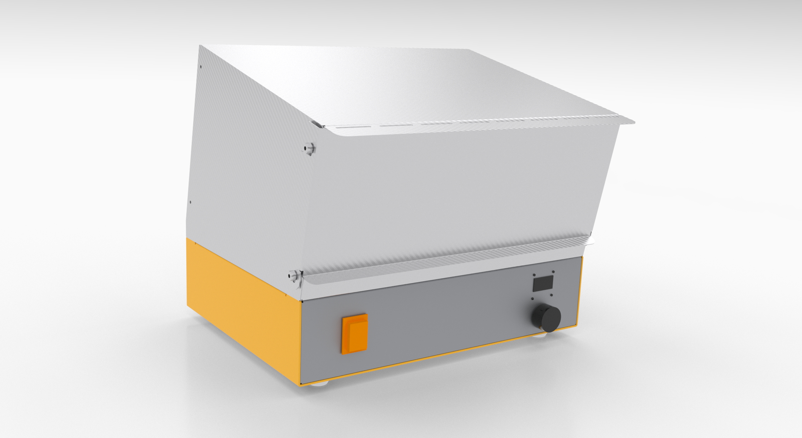
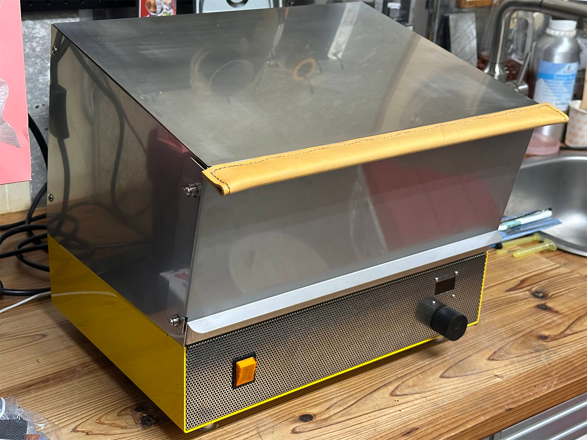
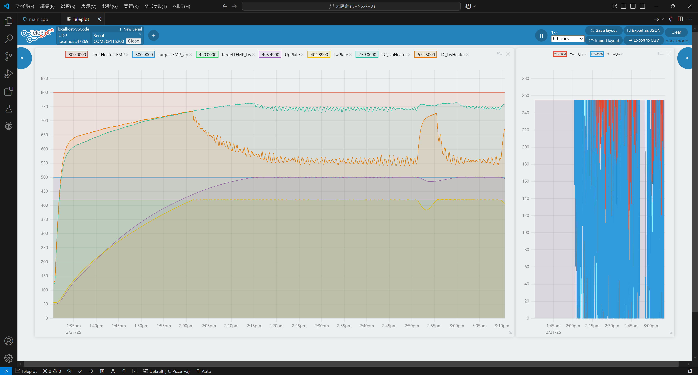

# Electric Pizza Cooker El-Pico
El-Pico, This is a programmable Electric Pizza Cooker (Oven)!
\

CADデータのレンダリングイメージ

## Why Pizza ?
おいしいピッツァを食べたい！→ピザ窯をつくろう
\
\
以下のデータを順次公開します。
* 板金用STEPファイル
* 3Dプリント用STLファイル
* ファームウェア
* 部品のリスト
* 配線や組み立ての手順
* レシピ

## 開発にあたって
* おいしいピッツァが焼けること
* 日本の家庭用コンセントで使えること（AC100V 15A以内）
* 窯の天井485℃以上、炉床380~430℃で90秒以内で焼成可能を目指す

## 実機写真

天井500℃、炉床420℃の設定で90秒の焼成でおいしいピッツァを焼くことが出来ました。

## コンセプト
### もっと多くの人を笑顔にしたい
開発のきっかけは、学園祭での飲食ブースの混雑と[Xの@SteveKasuya2さんのポスト](https://x.com/SteveKasuya2/status/1695339494550224910)でのオーブントースター改造ピザ窯で90 秒でピザを焼きあげる様子から、素早い提供を行えるマシンの開発に魅力を感じたことでした。
さらに、震災の報道で見た避難所の様子と[@nanbuwksさんの災害支援でピザ窯で炊き出しの記事](https://qiita.com/nanbuwks/items/adf3fea1b13d262047f9)にある支援活動の情報から、電気式のピザ窯の有用性を感じたのも理由です。

### 食は心身の健康の増進と豊かな人間形成に資する
2005 年には食育基本法が施行され、食育が現在及び将来にわたる健康で文化的な国民の生活と豊かで活力ある社会の実現に寄与するものであること、[SDGｓとも深くつながること](https://www.maff.go.jp/j/syokuiku/network/topics/2022forum.html)、また、生活の中で身近に体験する科学であり、結果をすぐに体感出来ることや新たな創意工夫を発想しやすいことから、プログラム可能なピザ窯開発を教材化しようと考えました。

### 新たな可能性は改良から生まれます。
公開するプログラムや設計を改良することで、新たな料理や素材に合わせた設定を探ったり、より良い制御を試すことが出来ます。\
筐体を作り変えたり、断熱材や蓄熱材、遮熱処理などを変更するとどうなるか、より使いやすくするためのアイデアを考えたり、MakersFair や地産地消や防災・減災イベントなどへの参加や利用も出来ると思います。

## 制作にあたって
ヒーターはとても高温（750℃程度）になります。\
特にオーブン部分は金属部品の過熱による寸法変化や変形などもあり、それらを考慮した配線の長さや部材の選定、専用工具による圧着端子での配線を行ってください。\
有資格者や同等の知識を有する方が組み立てと配線および点検を行い、事故に対応できる環境で監視のもとで使用してください。

### 設計について
まず上述のオーブントースター改造ピザ窯での情報から、TS-4119Wを購入し改造を行いデータを収集することにしました。\
数回の改良を経て満足いく性能は発揮できたものの、使い勝手の向上やサイズと外観を良くするために筐体を設計することとしました。
#### 設計の際に考慮した改善点
* ピザピールを扱いやすいように開口部の幅を広げる
* 手前と奥の焼きムラを低減する
* 制御部を下段に配置し、本体幅を抑える
* 温度設定を本体の操作で変更できるようにする

### 既知の問題点
* 熱でドアが変形し、左右のロックが片側しかかからなくなる\
→ドアの設計を変更する（設計中）

### 仕様（ プロトタイプ）
シーズヒーター * 5　合計1324W\
K 熱電対 * 4　（ヒーター * 2、プレート * 2）\
SSR * 2\
セラミック蓄熱プレート * 2\
板金部品　SUS304、A5052、SPCC（粉体塗装）\
冷却ファン、スイッチング電源

Pro Micro とMax6675 K熱電対を使用し、ヒーターをPID 制御\
リミット温度超過や熱電対断線時にはヒーター切\
ヒューズによる過電流保護\
OLED とロータリーエンコーダで温度設定を変更可能

## 公開データ
### 制作または発注する部品
板金用STEPデータ\
3Dプリント用STEPデータ

### 制御プログラム
[ProMicro用ファームウェア](Firmware)\
VS Code & PlatformIOを使用します。\
TelePlotで温度やSSRへの出力値（0-255）をグラフ表示することも可能です。

### 必要部品

|部品名|型番や仕様|必要数量|参考購入先|備考|
|---|---|:-:|---|---|
シーズヒーター|345mm 315mmL 300W, 110V|3本|[AliExpress](https://ja.aliexpress.com/item/1005006249800119.html)|合計743W（100V使用時）
シーズヒーター|350mm 320mmL 350W, 110V|2本|[AliExpress](https://ja.aliexpress.com/item/1005006249800119.html)|合計581W（100V使用時）
セラミックの部品|OD9.8xH11xID6.7|10個|[AliExpress](https://ja.aliexpress.com/item/1005002340926694.html)|ヒーターと筐体の絶縁に仕様
ピザプレート|ツインバード 892009|2枚|[yodobashi](https://www.yodobashi.com/product/100000001002338272/)|TS-4119Wから流用
セラミックファイバーブランケット|厚み12.5mm|1|[MonotaRO](https://www.monotaro.com/p/2859/6829/)
アルミシート|||[Amazon](https://www.amazon.co.jp/dp/B00I7KU4JC)
耐熱電線 |15 AWG|5m|[AliExpress](https://ja.aliexpress.com/item/1005004792599537.html)
断熱編組スリーブ||1|[Amazon](https://www.amazon.co.jp/dp/B0861VLQ2J)
片サドルバンド|625-210-B|2個|[MonotaRO](https://www.monotaro.com/p/0109/6515/)
SSR||2個 |[Amazon](https://www.amazon.co.jp/dp/B0CC4VYYJ5)
SSRヒートシンク||2個|[Amazon](https://www.amazon.co.jp/dp/B0CTQBSR3H)
放熱用シリコーン||1|[Amazon](https://www.amazon.co.jp/dp/B004OQP8RQ)
Max6675 モジュール||4個|[AliExpress](https://ja.aliexpress.com/item/1005006282367831.html)
K熱電対Φ5mm|1m M8 K, 200mm|2個|[AliExpress](https://ja.aliexpress.com/item/4000097994613.html)
K熱電対Φ1mm|K 1mm, 200mm|2個|[AliExpress](https://ja.aliexpress.com/item/1005004874800021.html)
ProMicro||1|
タクトスイッチ||1|
パネルマウントUSB-C延長ケーブル ||1|[Amazon](https://www.amazon.co.jp/dp/B0887XHFML)
スイッチング電源 |ESP10-25-12|1|[MiSUMi](https://jp.misumi-ec.com/vona2/detail/110400281630/?ProductCode=ESP10-25-12)
ステンレスカラー|TCLSS4-6-10|4|[MiSUMi](https://jp.misumi-ec.com/vona2/detail/110300235050/?ProductCode=TCLSS4-6-10)
PCファン||1|[Amazon](https://www.amazon.co.jp/dp/B09M6HTSC3)
ファンガード||1|[Amazon](https://www.amazon.co.jp/gp/product/B00YH754QM)
ロッカースイッチ|A8A-216-1|1|
OLED|SSH1106 1.3 I2C|1|[Amazon](https://www.amazon.co.jp/dp/B07QC5W46K)
ヒューズホルダー||1|[MiSUMi](https://jp.misumi-ec.com/vona2/detail/222004911089/?ProductCode=FH-052S)
ガラス管ヒューズ||1|[Yodobashi](https://www.yodobashi.com/product/100000001002122484/)
圧着端子
組端子台||1|
DINレール||1|[Amazon](https://www.amazon.co.jp/dp/B076LWQCW7)
DINレール固定金具|||[Amazon](https://www.amazon.co.jp/dp/B013CXAX9Y)
電源コード||1|[Amazon](https://www.amazon.co.jp/dp/B00ID1S2W6)
インレット|C14|1|[MiSUMi](https://jp.misumi-ec.com/vona2/detail/110400165860/?ProductCode=WTN-1171AA)
電線
ステンレストラスねじ|M4-4|
ステンレストラスねじ|M4-12|
ステンレス針金
ねじ脚|MN-25M8|4|[MiSUMi](https://jp.misumi-ec.com/vona2/detail/221000121526/?ProductCode=MN-25M8)

### 必要工具
鉄鋼やすり\
+ドライバー\
ラチェット式圧着端子用工具\
はんだごて